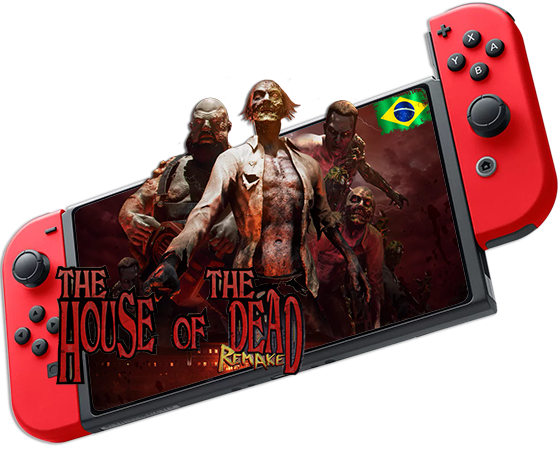

<h1 align="center"><figure>
  
</figure></h1>

## :small_blue_diamond:Sobre a Tradução.

O objetivo do projeto é:

_ "Traduzir 100% do jogo com a melhor qualidade possível" _

## :small_blue_diamond:Por quê?

Este projeto irá ajudar muitas pessoas a entender melhor a história do jogo, portanto ficarei feliz se você puder ajudar de alguma forma o projeto, tradução, erros ortográficos e revisão em jogo!

## :small_blue_diamond:Requerimentos

- Nintendo Switch Debloqueado - SXOS ou ATMOSPHERE>

## :small_blue_diamond:Instalação

Em Breve..

## :small_blue_diamond:Ferramentas Ultilizadas

:link: [Visual Studio Code](https://code.visualstudio.com)

## :small_blue_diamond:Doações

Obrigado!:wave:
